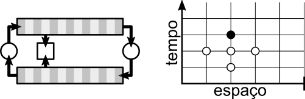
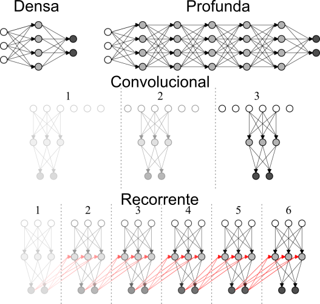
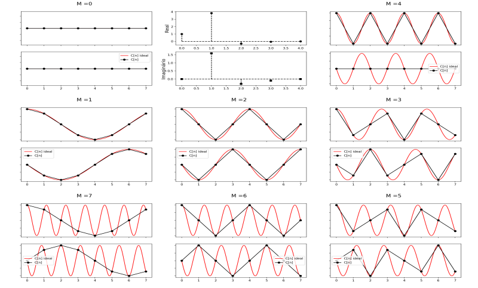
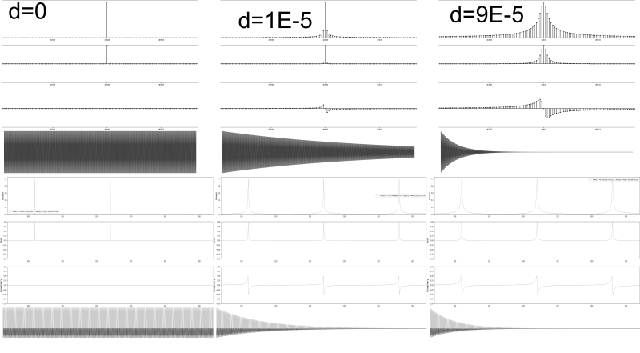
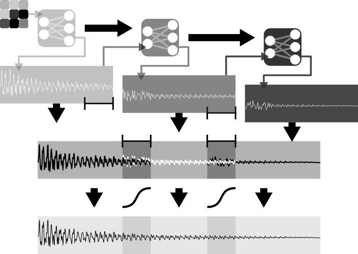
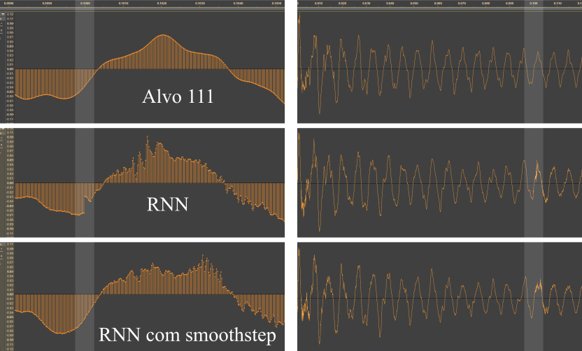
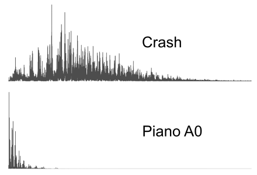
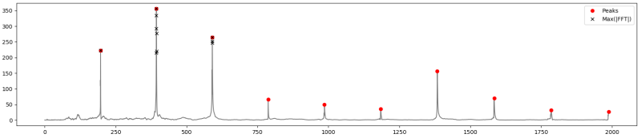
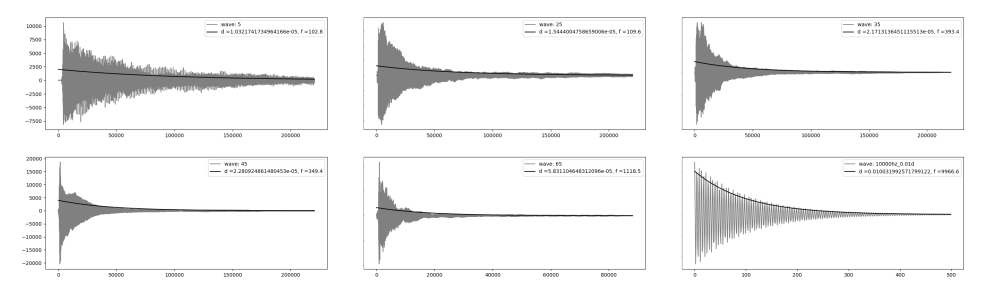
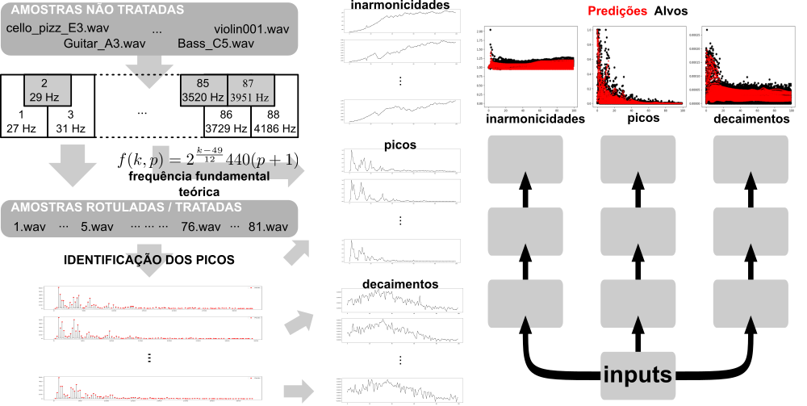

# UNIVERSIDADE FEDERAL FLUMINENSE

ESCOLA DE ENGENHARIA

PROGRAMA DE PÓS-GRADUAÇÃO EM ENGENHARIA DE PRODUÇÃO

**Redes Neurais Aplicadas à Modelagem de Instrumentos Acústicos para Síntese Sonora em Tempo Real**

Carlos Tarjano 

Orientador: Prof. Dr. Valdecy Pereira

Niterói, 31 / 07 / 2018

---------------

# Introdução

## Objetivo: Elaborar um modelo baseado em ANNs para emulação de instrumentos em tempo real

Mapear o estado da arte da aplicação de ANNs em áreas correlatas

Mapear o estado da arte da modelagem acústica “tradicional”

Investigar o potencial de inclusão de teoria acústica na eficiência

## Motivação:

ANNs aplicadas com sucesso em várias áreas

Estado da arte em áreas afins

Poucos trabalhos relacionados a síntese sonora via ANNs (nenhum em tempo real)

Indústria de DMI “estagnada” e hermética

---------------

# Introdução

## Escopo:

Emulação de instrumentos acústicos

Excitação impulsiva

Tempo real

Arquiteturas Neurais consolidadas na literatura

---------------

# Revisão Bibliográfica

## ANNs:

Alguns trabalhos experimentais na década de 1990

Wavenet – bons resultados para voz (Magenta)

A Maioria das plicações de ANNs ocorrem em um nível mais alto de abstração

## Modelagem Acústica Tradicional:

Domínio da Frequência (Modelagem Espectral)

Domínio do Tempo (Modelagem Física)

## Principais métodos de Modelagem Física:

---------------

# Referencial Teórico - Redes Neurais - Arquiteturas

---------------

# Referencial Teórico

## Transformada Discreta de Fourier

---------------

# Referencial Teórico - DFT - SIMETRIA

---------------

# Referencial Teórico - DFT

Decaimento: domínio da frequência x domínio do tempo

---------------

# Metodologia

## Busca de amostras sonoras:

Variedade, Qualidade, Licença, Organização

## Investigação dos modelos tradicionais

Implementação e análise

## Domínio do tempo:

Redes Densas – Grid Search (Arquitetura, Função de ativação, Função de Otimização)

Redes Recorrentes + Convolução alisada

## Domínio da Frequência:

Busca por representações simplificadas

Aplicação direta de redes Densas | Aplicação fisicamente informada

---------------
# Metodologia - Modelos Tradicionais: Digital Waveguide

---------------

# Metodologia - Modelos Tradicionais: Diferenças Finitas

---------------

# Metodologia - Domínio do tempo:

---------------
# Resultados - Domínio do tempo:

---------------
# Resultados - Domínio do tempo:

---------------
# Metodologia - Domínio da Frequência:

Método direto para sons mal comportados

Método fisicamente informado para sons harmônicos

---------------
# Metodologia - Domínio da Frequência - Método Direto:

caixa, contratempo,tambores - 120 008 neurons, 1.4 Mb.

pratos - 360 008 neurons, 9 Mb.

redes com uma camada oculta

---------------
# Metodologia - Domínio da Frequência - Método Fisicamente Informado:

Redes: amplitudes e decaimentos - 5 301 neurons, 100kb | frequências 261 neurons, 50 kb

---------------
# Metodologia - Domínio da Frequência - Método Fisicamente Informado:

---------------

# Metodologia - Domínio da Frequência - Modelo Final:

---------------
# Metodologia - Domínio da Frequência - Modelo Final:

---------------

# Resultados - Domínio da Frequência:

## Método Direto:

Funcional para sons mal comportados (percussão)

## Método Fisicamente informado:

Ideal para instrumentos harmônicos

Eficiência 10x maior do que Digital Waveguides (implementação em Python)

Verossimilhança maior do que o método das diferenças finitas

---------------

# Conclusão

## Contribuições:

Apresenta um modelo eficiente para modelagem acústica

Aponta uma nova área de pesquisa, na interseção entre acústica e redes neurais

Apresenta alguns potenciais e limitações dessa área, no domínio do tempo e da frequência

Interpretação geométrica da simetria da transformada discreta de Fourier aplicada à sinais no domínio real.

Relação entre envelopes (domínio do tempo) e formato das elevações (domínio da frequência)

## Oportunidades de Pesquisa:

Desenvolvimento de um método de extração de envelopes (possivelmente analítico)

investigar transferência de estilo fazendo uso do método acima

Utilizar Diferenças Finitas para treinar um algoritmo “Neural Waveguides”

Utilizar ANNs no lugar de funções utilizadas em modelos acústicos mais elaborados

Paralelizar as redes

---------------